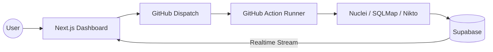

# 🛡️ VulnFusion

  

  <strong>Next-Gen Distributed Vulnerability Orchestration & Real-Time Intelligence</strong>

  
  
  
  

---

## 🚀 The Vision
**VulnFusion** is not just a scanner; it's a high-performance orchestration engine designed to bridge the gap between heavy security tools and modern web experiences. By offloading complex security compute to distributed cloud workers, VulnFusion provides real-time, industrial-strength intelligence without the wait.

## 🏗️ Pro Architecture (Zero-Cost)
VulnFusion leverages a unique "Tri-Cloud" architecture to remain free forever while delivering premium performance:

- **Frontend/API (Vercel)**: Handles the mission-control dashboard and job orchestration.
- **Intelligence Core (GitHub Actions)**: Every scan triggers a temporary, high-power Ubuntu runner to execute Nuclei, SQLMap, and more.
- **Data Nerve-Center (Supabase)**: Streams findings and raw logs directly to your browser using WebSockets (Realtime).

## ✨ Key Features
- **⚡ Smart Engine**: Fingerprints the target tech stack first to avoid wasting time on irrelevant tests.
- **📡 Live Execution Trace**: Watch the raw terminal output of security tools directly in your browser.
- **🛡️ Multi-Engine Parallelism**: Simultaneously engages Nuclei, SQLMap, XSStrike, and Nikto.
- **🎨 Cinematic UI**: A high-end command center built with Framer Motion and custom CSS glassmorphism.

## 🛠️ Powered By
- **Discovery**: Subfinder, HTTPX
- **Vulnerability Research**: Nuclei (Smart Filtering)
- **Deep Assessment**: SQLMap, Nikto, XSStrike
- **Backend**: Next.js 15, Prisma, Supabase Realtime

---

## 💖 Built with Love
Contributed with ❤️ by **[Naman](https://github.com/Naman-1508)**.

> "Security is not a product, but a process." - Bruce Schneier

---

### 📝 Setup & Deployment
For full setup instructions, please refer to the [Pro Deployment Guide](deploy_guide_pro.md).

1. Clone the repo
2. Create Supabase project & run `supabase_schema.sql`
3. Add GitHub PAT and Supabase keys to `.env.local`
4. Push and let the engines roar! 🚀
